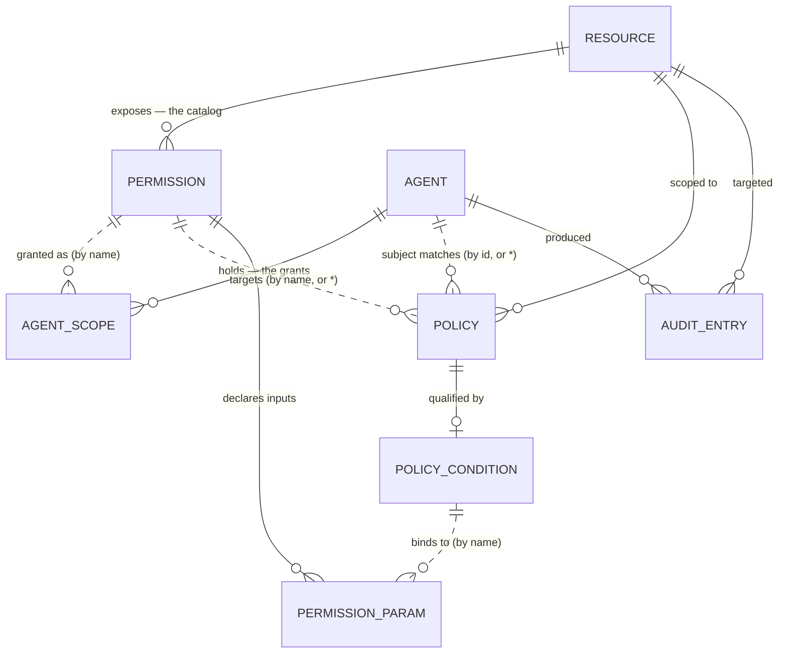

# Managent data model

Reference for the domain types in [`web/lib/types.ts`](../web/lib/types.ts) — what each
entity is, how they link, and where the current shape is prototype scaffolding
rather than a design decision.

## The one idea that organises everything

Three layers, deliberately separate:

| Layer | Scope | Answers |
|---|---|---|
| **Catalog** | Global to a resource | What *can* be called here? |
| **Grant** | Per (agent, resource) | What may *this agent* call? |
| **Policy** | Per (agent, resource) | Under what *conditions*? |

A resource publishes one catalog that every agent sees. Each agent holds its own
subset of it. Two agents on the same resource routinely have different access —
that is the normal case, not an edge case.

Confusing these three is the failure mode the UI was restructured to prevent: a
tool being *discovered* on an MCP server is not the same as an agent being
*allowed* to call it.

## Entity relationships



Solid lines are real containment (arrays inside an object). **Dashed lines are
string joins** — `AgentScope.permission` is a `string` that must match a
`Permission.name` inside `Resource.permissions`. Nothing enforces that today.
See [Structural weaknesses](#structural-weaknesses).

## Entities

### Resource

A governed system. A discriminated union on `kind`, so connection details are
type-safe per variant.

| Field | Notes |
|---|---|
| `id`, `name` | `id` is URL-safe and used in scope strings; `name` may differ (`postgres:invoices`) |
| `kind` | `rest` \| `mcp` \| `db` — drives the whole UI vocabulary |
| `discoveredVia` | `manifest` \| `auto` \| `manual` — provenance of the catalog |
| `permissions` | **The catalog.** Global to the resource |

Variant fields: `rest` → `targetUrl`, `authMethod`; `mcp` → `transport`,
`command`; `db` → `connectionHost`, `roleScope`, `tables`.

The `kind` also decides what a catalog entry is *called* — `CATALOG_LABEL` in
[`lib/data/resources.ts`](../web/lib/data/resources.ts) maps it to
Endpoints / Tools / Roles. The word "permission" is deliberately never used for
the catalog in the UI.

### Permission — a catalog entry

One endpoint, one MCP tool, or one database role.

| Field | Notes |
|---|---|
| `name` | The join key everything else references |
| `match` | Wire form: `POST /v1/refunds` for REST, absent for MCP and DB |
| `highRisk` | Destructive; surfaced in red throughout |
| `params` | Inputs a policy condition can bind to. Absent for DB roles |

### PermissionParam — a bindable input

Derived from OpenAPI parameters/body schema (REST) or a tool's `inputSchema`
(MCP). `location` is `path` \| `query` \| `header` \| `body` \| `argument` —
MCP has a single `arguments` object, so every MCP param is an `argument`.

**This is the most valuable part of the model.** Governing *which tool* an agent
may call is table stakes; governing *what arguments it may pass* is what
addresses prompt-injection-driven misuse, where the tool is legitimate and the
arguments are not.

### Agent — the principal

| Field | Notes |
|---|---|
| `id`, `name`, `owner`, `ownerEmail` | Identity and ownership |
| `status` | `active` \| `idle` \| `revoked` |
| `enforcementMode` | `monitor` \| `shadow` \| `strict` |
| `failOpen` | Allow calls through when the scope-check is unreachable |
| `scopes` | **The grants** — `AgentScope[]` |
| `coverage`, `calls24h`, `denied24h`, `lastActive` | Rollups (see below) |
| `tokenPreview` | Masked static token |

### AgentScope — a grant

The per-(agent, resource) half of the model. `{ resourceId, permission,
callsToday }`. Its existence *is* the grant; there is no `granted: boolean`.

### Policy — a rule

| Field | Notes |
|---|---|
| `resourceId` | Rules are always scoped to one resource |
| `subject` | `agent:<id>` for one agent, `agent:*` for a resource-wide default |
| `permission` | A catalog entry name, or `*` |
| `effect` | `allow` \| `deny` \| `require_approval` |
| `condition` | Optional `PolicyCondition` |
| `rateLimit` | Throughput cap when the rule matches |
| `order` | Lower runs first, **first match wins** |
| `enabled` | Disabled rules are skipped entirely |

`EffectivePolicy` is the resolved view: `Policy & { inherited: boolean }`,
produced by `getAgentResourcePolicies(agentId, resourceId)` in
[`lib/data/policies.ts`](../web/lib/data/policies.ts). Inherited rules keep their
position in the ordering rather than being grouped — since first match wins,
*where* a default sits relative to an agent's own rules is what decides the
outcome.

### PolicyCondition — the qualifier

Two authoring modes:

- `builder` — a `ConditionGroup` tree. Groups nest (`all` / `any`), leaves are
  `ConditionRule` (`field operator value`), so arbitrary shapes need no special
  cases.
- `expression` — a raw string escape hatch for anything the builder can't express.

`ConditionRule.field` is a qualified reference: `<location>.<param>` for call
inputs (`body.amount`, `argument.charge`) or `context.<name>` for request
metadata that exists regardless of resource.

### AuditEntry — the event stream

`{ id, time, agentId, resourceId, permission, action, outcome }`.

One org-wide array; every other activity view is a filter over it, so per-agent,
per-resource, and per-pair logs can never disagree.

## How a call is decided

```
agent calls resource.permission with arguments
  │
  ├─ 1. Is there an AgentScope for (agent, resource, permission)?   ── no ──► deny
  │
  ├─ 2. Walk getAgentResourcePolicies(agent, resource) in order.
  │       First rule whose permission matches AND whose condition
  │       holds against the arguments wins.
  │
  ├─ 3. Apply its effect: allow / deny / require_approval
  │
  └─ 4. Write an AuditEntry either way.
```

`enforcementMode` gates step 3: `monitor` logs what *would* happen, `shadow`
logs and warns, `strict` enforces. `failOpen` decides step 3 when the check
itself is unreachable.

## Structural weaknesses

Things that are prototype scaffolding, listed so they aren't mistaken for design.

**Joins are unenforced strings.** `AgentScope.permission`, `Policy.permission`
and `AuditEntry.permission` are all `string`s expected to match a
`Permission.name` in the right resource's catalog. Renaming a catalog entry —
or an MCP server renaming a tool between `tools/list` calls — silently orphans
grants and, worse, silently makes conditions stop matching. **A policy that
references a field which no longer exists should fail the rule, not skip it.**
Today nothing detects the drift at all.

**Rollups are stored, not derived.** `coverage`, `calls24h`, `denied24h`,
`callsToday`, `createdDaysAgo`, `lastActive` live on `Agent`/`AgentScope` as
literals. `createdDaysAgo: 34` and `lastActive: "2 min ago"` are display strings,
not data — they need to become timestamps computed at render.

**`AuditEntry.time` is `"14:12:03"`** — no date, no timezone, no ordering across
days.

**No tenancy.** No `orgId` anywhere. `CURRENT_ORG` in
[`components/dashboard/nav.ts`](../web/components/dashboard/nav.ts) is a placeholder constant.

**No timestamps, versioning, or soft deletes** on any config entity — so there
is no way to answer "what did this policy look like when that call was denied?",
which is the first question any audit will ask.

**No delegation dimension.** `Agent` is the only principal. In practice the same
agent acts on behalf of different users minute to minute, and its effective
access should differ accordingly. The model has no place to put the acting user,
so it cannot express "this agent, for this user". This is the largest modelling
gap — see [architecture-assessment.md](./architecture-assessment.md).

**`subject` globs don't scale.** `agent:*` and `agent:<id>` are fine at five
agents. At a hundred you want groups/labels as first-class entities rather than
string patterns, or you land in the same place as sprawling IAM policies.

**First-match-wins can't express "deny always wins".** A high-risk deny placed
below a broad allow is silently dead. Most authorization models make explicit
denies override regardless of position; this one doesn't.
